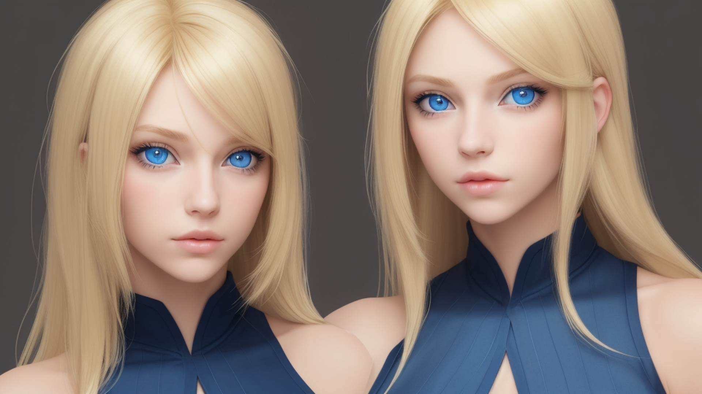
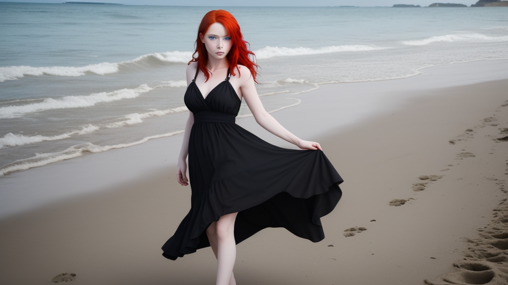

# AI Image Generator & Stylizer

[](https://www.python.org/downloads/)
[](https://opensource.org/licenses/MIT)

A powerful Tkinter-based GUI application that harnesses Stable Diffusion models for image generation and stylization. Supports **image‑to‑image** (img2img) and **text‑to‑image** (text2img) workflows, integrated upscaling, and VRAM‑saving options—all in a user‑friendly interface.




---

## ✨ Features

- **Two Generation Modes**  
  - **Image to Image**: Transform any input image using a text prompt and strength control.  
  - **Text to Image**: Create entirely new images from scratch using a prompt.

- **Flexible Model Management**  
  - Load local Stable Diffusion models (folders containing `model_index.json`).  
  - Download models directly from Hugging Face Hub (e.g., `Lykon/dreamshaper-8`, `stabilityai/stable-diffusion-2-1`).  
  - Saved model paths persist across restarts.

- **Fine‑Grained Controls**  
  - Prompt with separate style and content fields (content overrides style in text2img mode).  
  - Negative prompts to exclude unwanted elements.  
  - Adjustable inference steps, guidance scale, and resolution.  
  - Seed control for reproducible generations.

- **Advanced Upscaling & Enhancement**  
  - Choose from: None (simple resize), Real‑ESRGAN (fast, realistic), or Stable Diffusion img2img (artistic, slower).  
  - Final resolution presets: 1080p, 1440p, 4K, or custom dimensions.  
  - Adjustable sharpness for final output.

- **VRAM Saver Mode**  
  - Enable CPU offloading to run models on limited VRAM (slower but functional).

- **Real‑Time Preview**  
  - See intermediate results during generation in the Preview tab.

- **Memory Optimised**  
  - Automatic GPU/DirectML cache clearing after each generation.  
  - Attention and VAE slicing to reduce memory footprint.

---

## 🖥️ System Requirements

- **Operating System**: Windows, Linux, macOS (tested primarily on Windows).  
- **Python**: 3.8 or higher.  
- **RAM**: 8 GB+ recommended.  
- **GPU** (optional):  
  - NVIDIA with CUDA (supports PyTorch CUDA)  
  - AMD with DirectML (Windows only, see setup.bat)  
  - CPU fallback (slower but works).

---

## 🚀 Installation

### Windows (Quick Setup)

Double‑click `setup.bat`. This script will:

1. Create a Python virtual environment (`venv`).  
2. Install PyTorch with DirectML support (for AMD GPUs) or CPU fallback.  
3. Install all required libraries (diffusers, transformers, Real‑ESRGAN, etc.).  

After completion, activate the environment and run the app:

```cmd
venv\Scripts\activate
python img2img_ui.py
